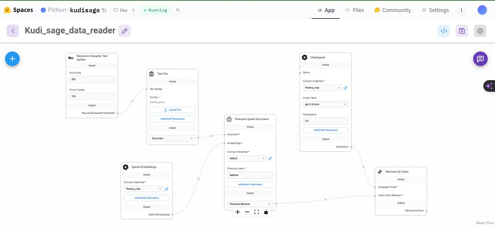
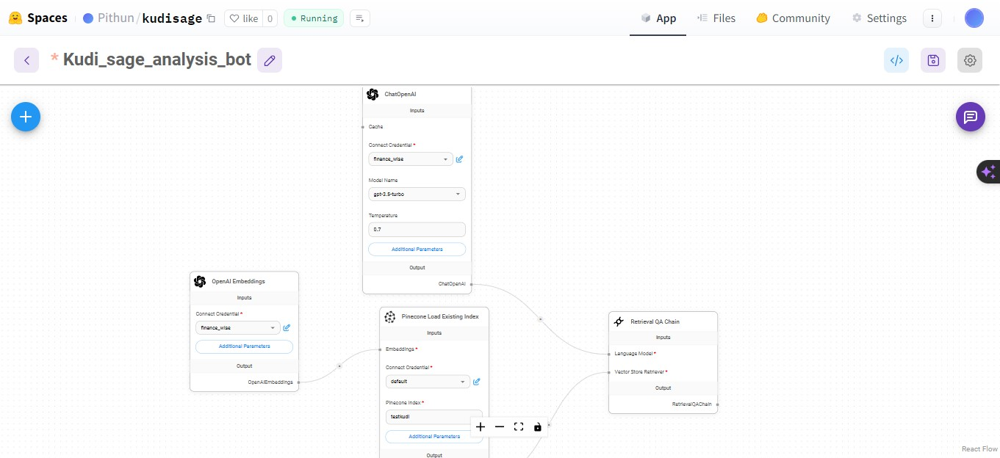
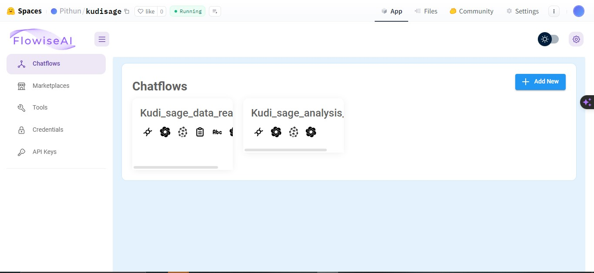
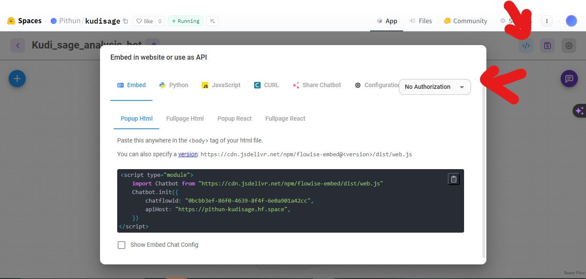
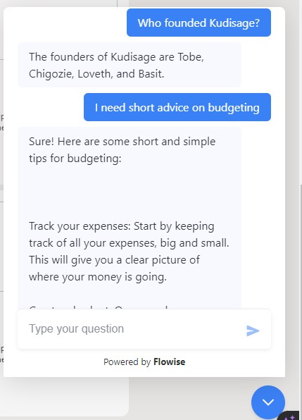

# KudiSage 
This repo implements a no code chatbot and some python analysis and machine learning predictions on customer spendings.

## Implementing the Chatbot for Kudisage
Step 1: Install [Node.js](https://nodejs.org/en/download)

Step 2: Run `npm install -g flowise` then run `flowise start`

Step 3: Get an API key for [OpenAI](https://platform.openai.com/account/api-keys) and Create an Index with [Pinecode](https://app.pinecone.io/). These are needed to proceed further.

Step 4: Create the ChatFlow to train the Chatbot with Data specific to Kudisage

Step 5: Create the ChatFlow for bot trained on Data about Kudisage

Step 6: Host the Chatflows on HuggingFace to access in live website. Refer [here](https://docs.flowiseai.com/deployment/hugging-face) for more details on hosting.

Step 7: Get API code to use Chatbot in Live website

Step 8: Use Bot

